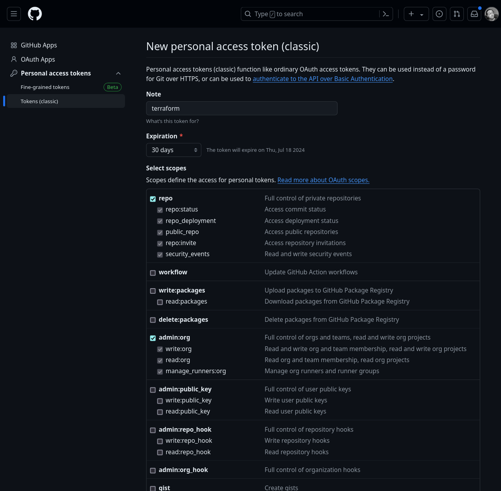
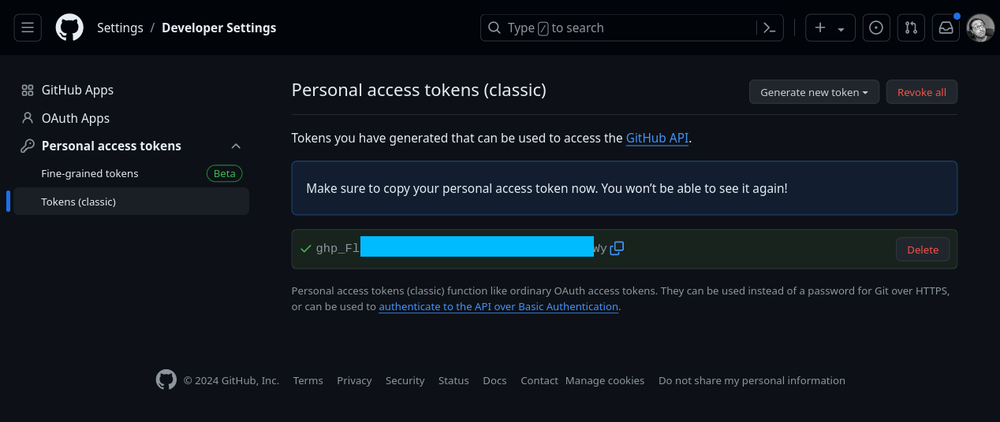

# GitHub organization

Useful links:

| Description                          | Link                                                                                                                                                         |
|--------------------------------------|--------------------------------------------------------------------------------------------------------------------------------------------------------------|
| Provider documentation               | https://registry.terraform.io/providers/integrations/github/latest                                                                                           |
| GitHub personal access tokens        | https://github.com/settings/tokens                                                                                                                           |
| How to create personal access tokens | https://docs.github.com/en/authentication/keeping-your-account-and-data-secure/managing-your-personal-access-tokens#creating-a-personal-access-token-classic |

## Pre-requisites

* A GitHub Account
* A GitHub personal access token (see _Getting credentials_ step)

## Getting credentials

To create a personal access token, go to your GitHub profile, in the _Developer Settings_ tab, _Personal access tokens_ section : https://github.com/settings/tokens

Give your token a name, an expiration date, and the `repo` and `admin:org` scopes.

Take note of the generated Token.

## Required env vars

This project needs 1 environment variable in order to be run :

| env          | value                                                    |
|--------------|----------------------------------------------------------|
| GITHUB_TOKEN | The personal access token generated at the previous step |

## Running the code

This code populated the 'ENI Terraform Samples' GitHub organization, and all the projects in the group.
You should not be running this code directly, but may want to adapt it.
The provider is configured with the `owner` variable.

### Inputs

| Name                                              | Description                                                | Type     | Default                   | Required |
|---------------------------------------------------|------------------------------------------------------------|----------|---------------------------|:--------:|
|  [owner](#input\_owner) | the owner of the projects to create (user or organization) | `string` | `"eni-terraform-samples"` |    no    |

### Outputs

| Name                     | Description                 |
|--------------------------|-----------------------------|
| github_repositories_urls | web url of the GitLab group |
